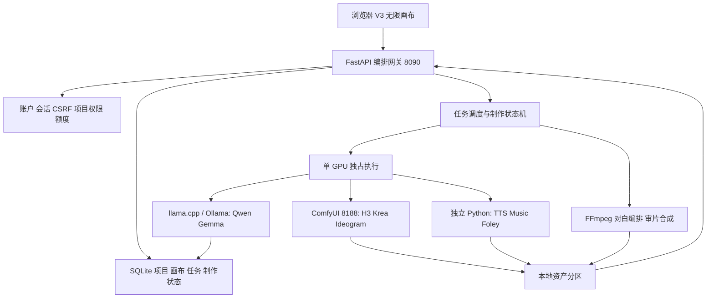

# 建设目标、开发进度与技术方案

统计截止：2026-09-05。依据为本地当前代码、配置、版本记录，以及 09-04 账户/Agent 与 09-05 Foley 验收记录。以下“通过”指记录中的验收，不是本次整理重新执行了全部 GPU 生成。

## 一、建设目标

建设“素材—创意—分镜—生成—审片—交付”一体化本地工作台，降低多模型分别操作的成本。让创作者在同一画布中建立文本、图片、视频和声音之间的真实输入关系，让团队按项目协作，保留生成参数与审批记录。

核心目标包括：模型及创作数据本地保存；单卡资源可控；参数可追溯；预览和终稿保持一致；团队权限在服务端落实；模型与程序分离，便于迁移、扩展与轻量发布。

## 二、完成情况

| 模块 | 当前建设成果 | 验证程度与边界 |
|---|---|---|
| 基础运行平台 | Windows、隔离 Python、ComfyUI、本地网关、诊断与启停入口 | 已本机运行；尚无全新机器一键安装验收 |
| V3 无限画布 | 平移缩放、选择、组合、撤销、重命名、类型化连接、素材拖入、节点内预览与下游派生 | 已实现并持续做自动测试和浏览器检查；V2 兼容入口保留 |
| 图片工作流 | 文生图、图生图、局部/身份编辑、批量结果选择 | Turbo BF16 1024/1536、Identity Edit 1024、Ideogram 1024 有实机结果；Raw 能力接入不等于所有编辑场景已验收；2048 为实验项 |
| H3 视频 | 文生、首帧、首尾帧、参考、对白驱动、原生采样与 Turbo 路线 | 有本地视频与预览复现记录；新节点默认原生质量路线，不代表每个模式本轮重测 |
| 声音 | IndexTTS 音色复刻、多角色对白编排、Music 3 音乐、Foley 视频音效 | Foley 最新通过网关真实生成约 10 秒 WAV；25/50/75 步菜单存在，实机冒烟使用 10 步 |
| 本地 Agent | Qwen 与 Gemma 提示词优化、创作问答、结构化分镜、逐镜连续性约束 | Qwen 真实完成 6×5 秒文字方案；规划器当前不读取图片像素 |
| 制作与审片 | 草稿、不可变制作副本、串行子任务、失败暂停、手动重试、取消持久化、FFmpeg 顺序合成 | 自动流程与真实编码测试通过；09-04 未做整套真实视频加配乐出片验收 |
| 账户与团队 | 邀请注册、个人空间、项目负责人/制作/审核/查看、头像、项目分区 | 权限与 HTTP 隔离测试通过；平台管理员不隐式拥有所有项目内容权限 |
| 资源与用量 | 单 GPU 独占、任务数/运行分钟/登记资产空间、额度与队列优先级 | 额度是入队准入，未做精准运行时长预扣；长期公平调度待多人试用 |
| 公网与发布 | 有 Tunnel 参考与发布兼容结构；本次补充轻量源代码发布资料 | 公网未开通验收；纯静态托管不能替代本地 GPU 后端 |

09-05 验收记录：前端规则 35/35、后端 60/60、静态发布路由 4/4，TypeScript 检查和正式构建通过。这些组数不能简单相加当作一次独立全链路测试。

## 三、架构

| 层级 | 技术与职责 | 主要实现 |
|---|---|---|
| 交互 | React 19、TypeScript、Vite、React Flow、Zustand、Zundo | `services/ui-v3/src` |
| 网关 | FastAPI/Uvicorn，统一 HTTP 接口、权限和文件访问 | `services/orchestrator/workbench/api.py`、`auth.py` |
| 持久化 | SQLite、项目创建者固定分区、任务和资产元数据 | `store.py`、`production.py` |
| 生成调度 | 单进程 worker、单卡串行、模型族切换和超时 | `worker.py`、`providers.py` |
| 工作流编译 | 视频参数目录、H3-IR、图片工作流和分镜校验 | `h3_ir.py`、`image_workflows.py`、`storyboard.py` |
| 专用推理 | 独立进程和独立依赖，结构化请求与结果协议 | `services/adapters` |
| 媒体处理 | FFmpeg/ffprobe、音轨编排、视频顺序拼接 | `media_tools.py`、`video_assembly.py` |

一次生成先校验角色、输入类型、参数及额度，再将任务持久化并排队；worker 释放冲突模型后调用对应 provider；结果登记到项目资产并更新节点。下载仍经项目权限或短期票据，不直接暴露本机文件系统。

## 四、主要问题的应对方法

| 工程约束 | 采用的方法 | 代价或边界 |
|---|---|---|
| 大模型争抢单卡显存 | 全模型统一队列，按模型族释放/切换，独立环境执行 | 首次切换有等待，不追求多模型同时常驻 |
| Windows 加载稳定性 | 图像 BF16 使用保守低显存装载；避开不稳定热卸载；H3 使用自己的已验证参数 | 不把一个模型的加速配置直接套给所有模型 |
| 质量和速度选择 | 原生 20/30/40 步与配套 4/8 步 Turbo 分开，尺寸与步数独立 | 步数档不是画质提升保证；BF16 图像不代表 H3 全链路 BF16 |
| 提示词难追溯 | 保留创作原文，显示实际编译指令，预览/提交用同一编译器 | 摄影机与风格是软指令，不是物理仿真参数；H3-IR 是项目自己的实现 |
| 跨镜头失去上下文 | 每镜携带共享角色、服装、场景和风格约束，使用稳定素材 ID | 文字连续性不能保证视觉人物完全一致 |
| 自动制作重复提交或失败 | 不可变方案副本、幂等草稿、失败暂停、有限手动重试、取消持久化 | 审片拼接不等于自动精剪或叙事审核 |
| 离线运行缺少依赖 | 下载阶段备齐编码器、VAE、分词器等；推理阶段强制离线 | 主权重下载完成不等于整个 provider 就绪 |
| 多人访问越权 | 项目角色、服务端二次校验、短期下载票据、用户/项目磁盘分区 | 属于应用层隔离，不是磁盘管理员级别的加密隔离 |
| GitHub 大文件和隐私 | 允许名单导出、路径脱敏、私密值比对、文件/总量阈值检查 | 下载模型仍消耗部署者流量，不占源代码仓库体积 |

## 五、迭代修复摘要

- 优化了生成结果节点与独立编辑面板的缩放显示问题。
- 优化了提示词引用菜单的裁切、定位和中文输入交互问题。
- 优化了模型族切换时的显存释放与运行稳定性问题。
- 优化了多角色音频连接、音效节点分类和旧画布迁移问题。
- 优化了项目权限刷新、素材隔离和重复制作任务提交问题。
- 优化了分镜角色连续性传递与生效指令可见性问题。

## 六、下一阶段

优先完成隔离新机部署和真实分镜成片验收，再开展多人长时试用与公网预发布。后续可推进视频放大工作流、2048 图像稳定性、可视内容理解、精细声音时间轴、公平调度、完整账户找回/封禁/设备管理以及历史媒体物理迁移。以上均不列为已完成能力。
