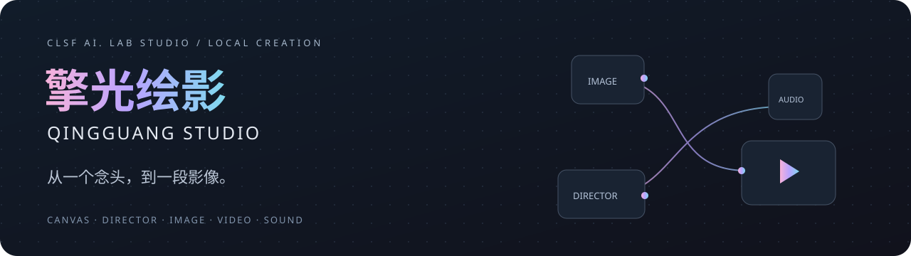
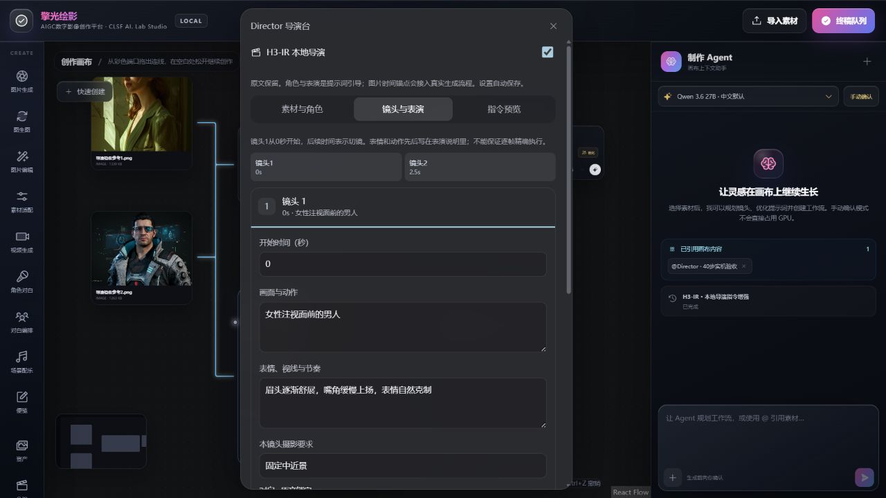
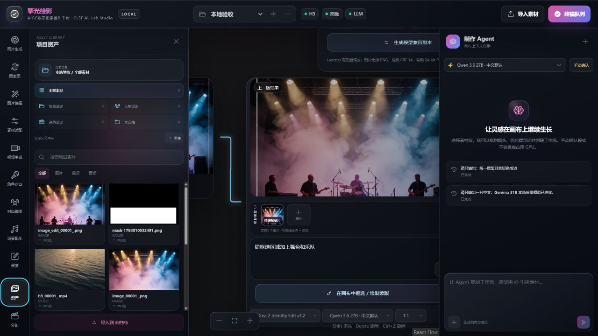
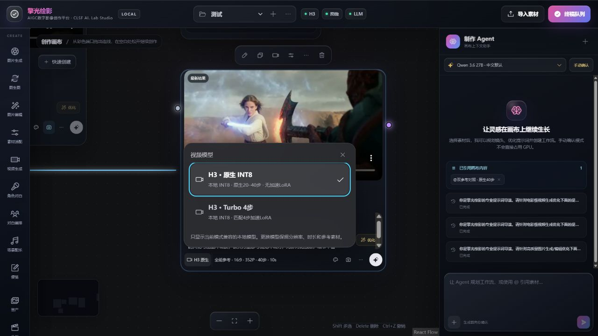
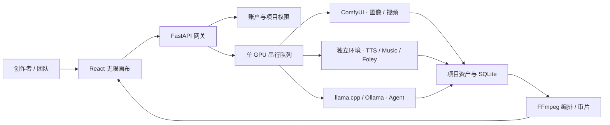

**把素材、镜头与声音，连接在同一张画布上。**

本地多模型 AIGC 数字影像创作平台 · CLSF AI. Lab Studio

`Windows` · `RTX 5090` · `Local inference` · `React + Python`

[界面展示](#工作台一览) · [实测视频](#真实生成样片) · [部署指南](DEPLOYMENT.md) · [Agent 部署约定](AGENT-DEPLOYMENT.md)

---

擎光绘影将图像、视频、对白、音乐和影视音效组织为可连接、可复用的节点。创作者在无限画布中导入素材、规划分镜、调整参数；后台负责模型切换、单卡排队和项目资产归档。

**当前阶段：本地集成可用，持续验收。** 功能与测试统计截止 2026-09-05；展示页于 2026-09-06 整理。完整新机安装与公网运营尚未完成验收。

## 一张画布，串起创作流程

| 创意与分镜 | 图像与视频 | 对白与声音 |
|---|---|---|
| 本地 Qwen / Gemma 提示词优化 | H3 文生、首帧、首尾帧与参考视频 | IndexTTS 2.5 参考音色与多角色对白 |
| 结构化分镜与每镜连续性设定 | Krea 2 图像生成、主体与局部编辑 | Music 3 音乐与配乐 |
| 可见导演指令，保留创作原文 | Ideogram 4 文字与版式图像 | Foley XXL 视频同步音效 |

**创作流程：** 导入素材 → 连接节点 → 调整镜头与提示词 → 排队生成 → 审片 → 继续创作 / 导出。

项目提供邀请制账户、负责人/制作/审核/查看角色、项目资产分区与用量统计。统一队列串行使用 GPU，避免多个大模型同时争抢显存。

## 工作台一览

以下是项目实际界面的历史验收截图，已检查可见内容，不包含浏览器账号、访问密钥或本机路径。用于展示交互设计，最新布局可能随迭代调整。

### 01 / Director 导演台

安排动作、表演与摄影意图，按素材角色组织参考输入；同一后端编译器生成指令预览与实际提交文本。

2026-09-01 · 实际导演台与 Agent 面板。摄影参数属于提示词指导，不是物理摄影机模拟。

### 02 / 项目资产与图像编辑

图片、视频与音频按项目集中管理，支持场景、人物、道具分类。局部编辑沿用同一条指令，生成结果可继续连接到下一步。

2026-08-29 · 资产库和 Identity Edit 图像编辑验收界面。

### 03 / 模型路线与生成参数

在节点附近选择原生质量或配套 Turbo 路线，独立调整分辨率与采样步数，保留旧任务的实际参数。

2026-08-29 · 历史模型选择面板。当前新建 H3 节点默认 1344×768、原生 30 步；截图中的旧任务设置不代表当前默认值。

## 真实生成样片

**[▶ 查看约 5 秒 H3 实测视频](assets/director-demo.mp4)** · 约 267 KB 展示版

| 项目 | 记录 |
|---|---|
| 实测日期 | 2026-09-01 |
| 模型路线 | H3 原生 INT8 ConvRot，多模态参考 |
| 原始参数 | 1344×768、40 步、124 帧、Seed 7、无 Turbo LoRA |
| 展示版 | 960 像素宽压缩 MP4，保留原片音轨，移除文件元数据 |
| 展示目的 | 查看人物表演、镜头与参考输入效果；不保证指令逐项精确执行 |

这是已有真实模型输出的压缩展示副本，用于快速浏览，不作为原始编码质量的评判依据。

## 已验证什么

| 验证层级 | 代表性结果 | 实际含义 |
|---|---|---|
| 自动回归 | 前端规则 **35/35**；后端 **60/60**；发布路由 **4/4** | 09-05 验收记录，不是本次重新执行全部推理 |
| Krea 2 Turbo BF16 | 1024×1024、1536×1024 真实出图 | 2048 仍是实验规格 |
| Identity / Ideogram | Identity 1024 编辑；Ideogram 1024、48 步出图 | 已验收场景不等于所有编辑任务通过 |
| Foley XXL | 约 10 秒视频 → 48 kHz WAV，资产回写成功 | 实机冒烟使用 10 步，并非所有质量档完整评测 |
| Agent 分镜 | Qwen 真实完成 6×5 秒文字规划 | 规划器不读取图片像素；文字规划不等于整片画质验收 |
| 轻量发布 | 脱敏、配置保护、文件校验、语法与暂存检查 | 模型、环境、用户数据库不进入仓库 |

完整记录与边界见 [开发进度](PROJECT-STATUS.md) 和 [公开包验证说明](RELEASE-VALIDATION.md)。

## 系统如何协作

## 从哪里开始

1. [目标、进度与技术方案](PROJECT-STATUS.md)：了解已交付能力与下一阶段。
2. [详细部署指南](DEPLOYMENT.md)：核对硬件、运行栈、模型来源和恢复步骤。
3. 用 `scripts/initialize_public_config.py` 创建自己的配置，按需下载模型并逐模态验收。
4. [Agent 部署约定](AGENT-DEPLOYMENT.md)：可直接交给部署 Agent 阅读。

本机基线：RTX 5090 / 32 GB 显存 / 64 GB RAM；Python 3.12.13 + PyTorch 2.11.0/cu130。默认入口 `127.0.0.1:8090/v3`，ComfyUI 内部端口 8188。

## 轻量仓库，模型另行下载

只保存源码、配置模板、版本文本、部署文档与少量精选展示素材。**不上传模型权重、虚拟环境、node_modules、用户素材库、数据库、密钥或日志。** 约 1.3 MB 配图/视频使用明确允许名单，其他媒体仍默认排除。

[发布与流量控制说明](PUBLISHING.md)

<strong>当前能力边界与许可</strong>

- Agent 规划器使用素材名称和用户描述，不宣称已完成图像像素理解。
- 自动审片是顺序拼接，不等于自动精剪或叙事质量审核。
- 分镜流程与编码测试，不等于完整真实视频加配乐出片验收。
- 模型及第三方组件各自许可独立。项目尚未指定统一开源 LICENSE，公开源码不等于任意商业授权。
- 本地运行验收不等于公网生产验收；不要直接暴露 ComfyUI。

